# Design of inter integrated circuit (I2C) in 0.6um CMOS

## Abstract
This article describes the detailed design and implementation of I2C slave circuitry for write and read operations from a latch unit, implemented in a 0.6μm CMOS technology. For the purpose of demonstration, the I2C circuit was designed and fabricated in 0.6µm CMOS technology.

## Introduction
An I2C protocol is one of the serial communication protocols that are used for chip to chip communication. Similar to the I2C protocol, SPI and UART are also used for chip to chip communication. The I2C is the short form of Inter-Integrated Circuit, a type of bus, which was designed and developed by Philips in 1980 for inter-chip communication. I2C is adopted by a lot of vendor companies for the chip to chip communication.

Features of I2C protocol:
- In I2C only two buses are required for the communication, the serial data bus (SDA) and serial clock bus (SCL). 
- Each component in I2C bus is software addressable by a unique address, this unique address is used by the master to communicate with a particular slave. 
- Always a master and slave relationships exist at all times in I2C. 
- In I2C, communication is started by the master. 
- The master can send data to a slave or receive data from a slave - slaves do not transfer data between themselves.
- I2C is the 8-bit oriented serial bidirectional communication, there are following speed mode in I2C.

|  MODE            | SPEED         |
|:------------------:|:---------------:|
| Standard-mode    | 100 Kbit/s    |   
| Fast-mode        | 400 Kbit/s    |
| Fast-mode Plus   | 1 Mbit/s      |
| High-speed mode  | 3.4 Mbit/s    |

Table 1: I2C Speed Modes

## Circuit Design

This design describes a simple circuitry which writes data in a data latch and reads the same data through I2C Fast-mode Plus protocol. The design contains a start-stop circuit, 8 bit shift register, 5 bit up counter, enable controller circuit, comparator circuit and address and data latch circuits. Start-stop circuit can detect the start and stop condition from the SDA and SCL signals. Shift registers are used to transmit and receive the address and data for write and read operations respectively. Different controlling signals were generated by the help of a comparator circuit which takes inputs from counter outputs. Minimum 18th count state was needed to detect stop condition given by the master; hence a mod-18 synchronous up counter was designed. The enable controller circuit was used to achieve bidirectional nature of SDA wire by tri-stating the output of the shift register with the input of PAD BBC1P. Three latch circuits: Address latch, data latch and R/W latch were designed to store slave address, data and R/WB bit sent by master. These circuits are designed and simulated in cadence virtuoso. This article describes the design of I2C accessible latch implemented in a 0.6μm CMOS technology.

|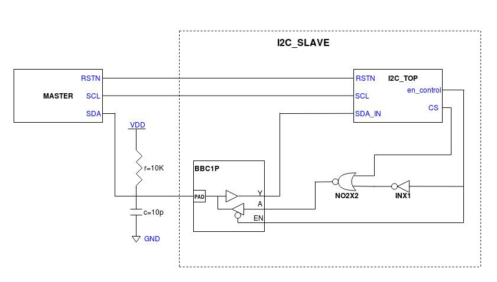|  
|:--:| 
|*Figure 1: I2C Master-Slave configuration*|
                                                                 

## Write Operation

In the case of a “write” operation, the R/WB bit is kept low. In this operation, the master circuit is supposed to send the data bits along with the address bits. Hence, after the address bits are received and latched into the address latch circuit, the following data bits move into the first set of (SIPO) shift-registers. From this set of shift registers, the data is sent into the data latch and with help of “en_data”, the data is latched into the data latch circuit.

|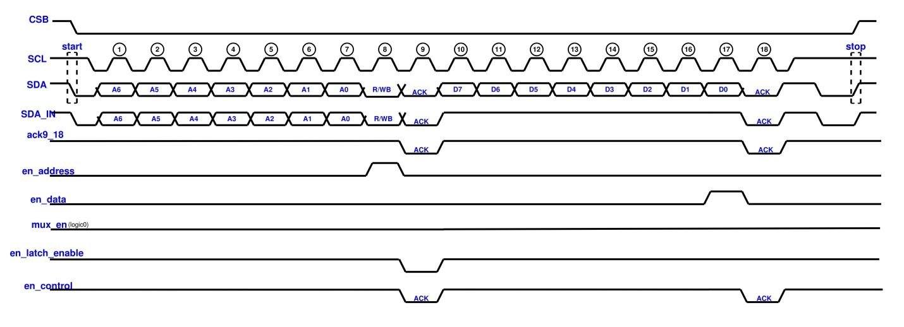|
|:--:| 
|*Figure 2: Timing diagram for write operation*|

## Read Operation

In case of a read operation, the R/WB bit is kept high. With the help of the mux_en signal, the second set of (PISO) shift registers are activated in case of read operation, as soon as the R/WB bit is received. The second set of shift registers receive data bits from the data latch and with each clock cycle, shift the data bits into the “SDA_OUT” line. The “SDA_OUT” is subsequently, with help of the “Enable Controller” circuit and the PAD, tri-stated into the SDA signal.

|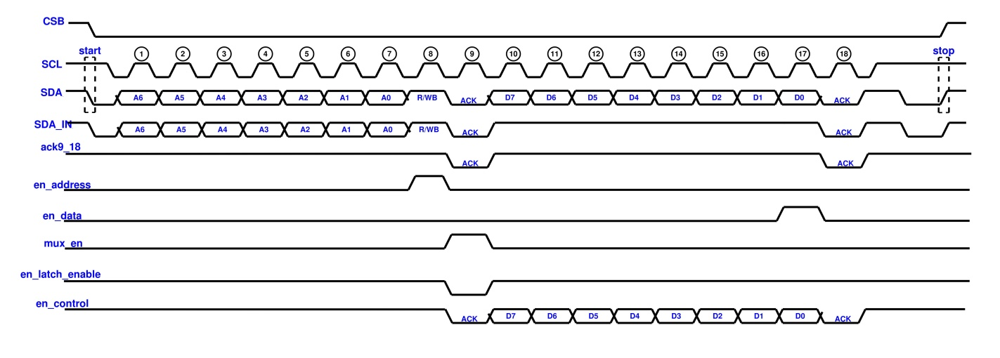|
|:--:| 
|*Figure 3: Timing diagram for read operation*|

## The start and stop circuit

For the start condition to occur, the SDA needs to be pulled low while the SCL remains high. As mentioned earlier, the time period of SCL is 1 micron while that of SDA is 2 micron. In this case, the Vbit source for SCL is given a delay of 1.5 microns. The Vbit for SDA is given as 1 micron. This makes it possible for the SDA to be pulled low while SCL remains high as shown in Figure II.2. An additional delay of 16 ns is given so that the SDA bits change while the SCL remains low, i.e. a low level triggered operation.

|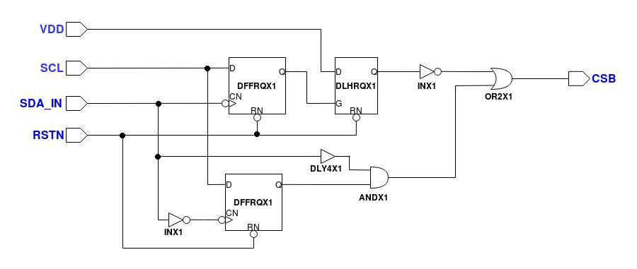|
|:--:| 
|*Figure 4: I2C start and stop circuit*|

## I2C Shift Registers

The shift registers constitute the most important circuit for I2C protocol implementation. The shift registers are made up of D Flip-flops. Here, we are using two sets of 8-bit shift registers, where one set is of resettable positive edge triggered D-FFs and the other is a set of 8-bit negative edge D-FFs. The first set of positive edge D-FFs are used as a SIPO register to retrieve the slave address as well as the data sent by the master in case of a write operation. The external “RESETN” signal is fed to the “RESET” of the D-FFs. The output of the first shift register is taken from the pins QA7 to QA0. These pins are connected to the latching circuit where the address, input data (for write operation) and the R/WB(read-write bit) is stored. The second set of negative edge D-FFs is used as a PISO shift register. Here, the data read by the slave from data latch which is fed in a parallel manner and the output is taken serially. However the serial output of this shift register needs to be put on the SDA signal in case of read operation. This is done by tri-stating the signal with the input SDA signal using a PAD that acts as a tristate buffer.

|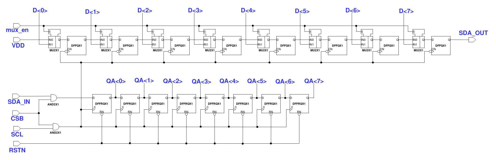|
|:--:| 
|*Figure 5: Schematic diagram of the 16-bit I2C shift register*|

## 5 bit synchronous up counter

This is a 5-bit synchronous up-counter that starts counting only when “start” condition is satisfied and counts till a “stop” condition occurs. It can count from 0 to 31 in binary number system.Its outputs are fed to the I2C comparator which is used to generate essential signals such as “en_address”, “en_data” etc. This counter is fed with the “SCL” as its clock along with necessary logic that turns it on only when “start” occurs.

|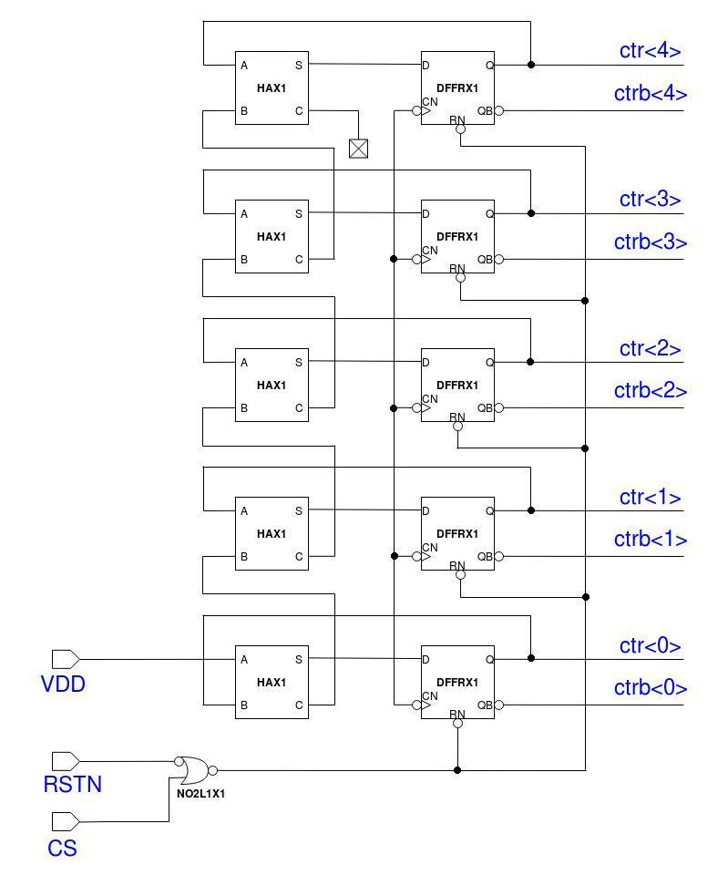|
|:--:| 
|*Figure 6: Schematic diagram of 5 bit synchronous up counter*|

## I2C Comparator

The I2C chip comparator is a circuit that is used to generate various signals which are generated using the outputs of the 5-bit synchronous up-counter.
- mux_en: This signal is used to enable the parallel feeding of data into the 2nd shift register set. It is generated at the 9th clock cycle after the first 8 bits which contain the address as well as the R/WB bit. This signal is given as a logic 1 for one clock cycle only when there is a read operation. For a write operation, this is kept low. This is done with the help of the mux as shown in the above figure.
- en_address: This signal is generated to enable the latch that is used to store the address bits. This is generated at the 7th clock cycle with the help of a 5-input AND Gate.
- en_data: This signal is used to enable the data latch to store the data at the 17th clock cycle in case of a write operation. This is also done with a 5-input AND gate.
- en_latch_enable: This signal is used in the generation of the “EN” signal. It is given to the “en” pin of the latch used in the “enable controller” circuit. It is generated at the 6th clock cycle.
- ack9_18: These are the signals that are used to give the acknowledgement bits at the 9th and 18th clock cycles. Here 2 NAND gates are used to generate logic 0 at 9th and 18th clock cycles. The outputs of both the NAND gates are given to an AND gate whose output is fed to the enable controller with a necessary delay of 16 ns which is the difference between the edges of SDA and SCL.

|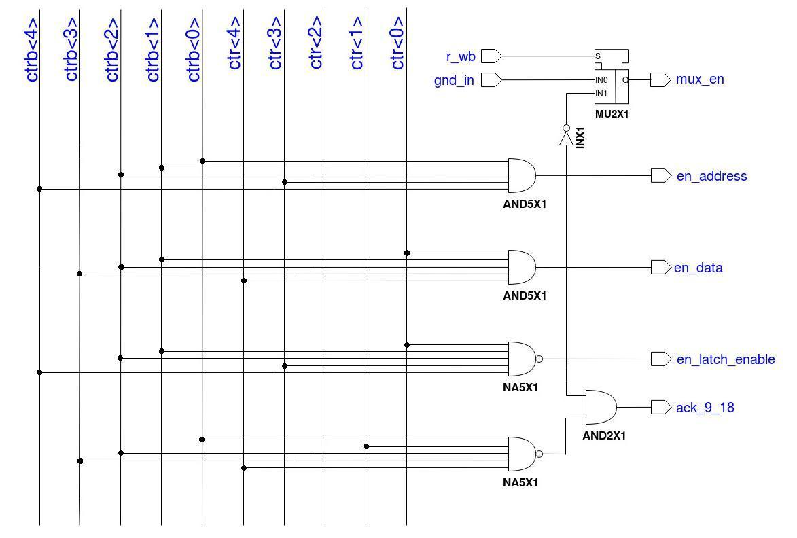|
|:--:| 
|*Figure 7: Schematic diagram of I2C comparator*|

## I2C Enable Controller

The PAD used for tri-stating the SDA needs an enable, “EN” signal to act as a tristate buffer. When its enable signal is kept high, the signal at the input is obtained at the output. When the enable goes low, the output is a logic 0. Therefore we designed an enable signal generator circuit which produces the required “EN” signal for the PAD.   
During the write operation, while the address is passed, the enable signal is kept high. This is done with the help of the latch and the OR gate as shown in Figure II.5. The complement of the R/WB bit is ORed with a logic 0 through a latch.  
After the address is passed, the enable signal is pulled low with the help of a 5-bit synchronous up-counter, and a NAND gate that gives logic 0 at 9th and 18th clock cycles.  This pulls the SDA low at the cycles mentioned above.   
After that the R/WB bit is analyzed and if it is a read, the “SDA_OUT” signal, which is the output of the 2nd shift register set, is put on the “EN”. If the operation is a write, the “EN” signal is made logic 1. In this way the SDA signal is tri-stated using a BBC1P PAD as shown in Figure II.1.  

|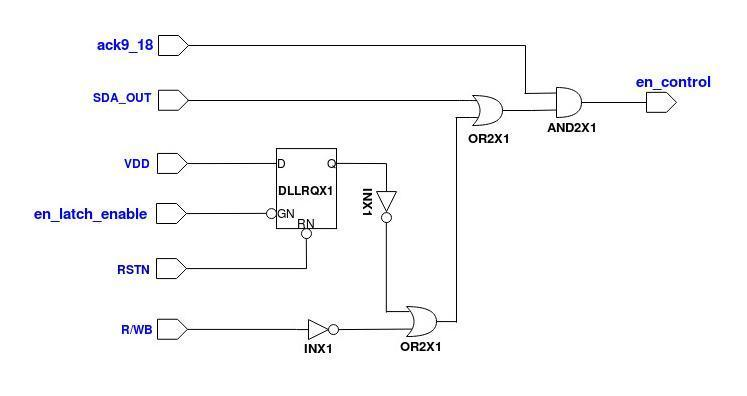|
|:--:| 
|*Figure 8: Schematic diagram of I2C Enable controller*|

## I2C Latch

The I2C latch circuit consists of 3 units: Address Latch, Data Latch and R/WB Latch.

- Address Latch: This is a 7-bit latch which is used to hold a 7-bit address. It consists of 7 positive edge triggered resettable D Flip-flops whose outputs are connected to their inputs through a 2:1 MUX. The “en_address” signal from the I2C comparator is fed to the selection line of the 2:1 MUX. When it is high, the MUX takes input from the parallel lines that come from the 1st shift register set which provides the address. As the en_address goes low, the output of the D-FF gets connected to the input through the MUX by which the flip-flop is able to store the particular bit given to it when en_address is high.

- Data Latch: The data latch has 8 D-FFs having the same mechanism as that of address and R/WB latch. It is used to store the data during a write operation. This data can be further fed to any memory unit such as SRAM. The selection lines of the 2:1 MUXs in data latch are fed with the “en_data” signal from the I2C comparator. At the 17th clock cycle, the data is latched into the data latch.

- R/WB Latch: The R/WB bit is the 8th bit of the SDA. It is stored along with the address. This has only one D-FF whose output is also connected to its input through a 2:1 MUX. The selection line of this MUX is also connected to the “en_address”.

|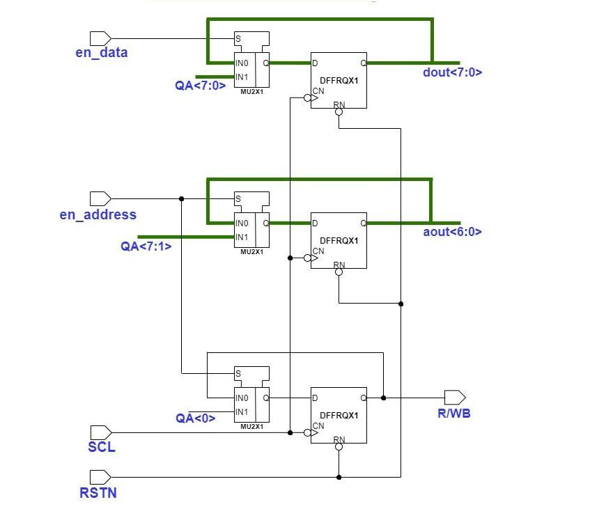|
|:--:| 
|*Figure 9: Schematic diagram of I2C Latch*|

## Circuit Simulation

For testing the circuit we used pull-up resistors having 100 Ohm resistance for all the signals except “SDA”. In case of SDA, the signal due to its bidirectional nature, is fed to the circuit from the test source through a PAD acting as a tristate buffer. For SDA, we use a 10 kilo-ohm pull-up resistor; the parasitic capacitance involved is 10pF.  
Using the Cadence Virtuoso software, the circuit was simulated. In order to simulate the operation, we used an 8-bit data, “11001100”. First this data was written into the slave, during which the “R/WB” bit was kept low. Then within the same frame, the data was also read from the slave during which the” R/WB bit” was kept high. For a proper simulation, we used a transient analysis of 50 microseconds. The result is shown in the figure below.

|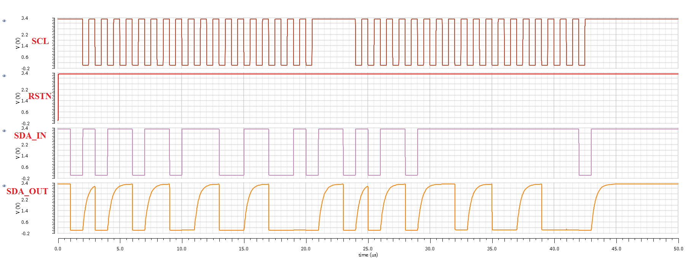|
|:--:| 
|*Figure 10: Simulation Result*|

## Layout Design

The layout of the circuit as shown in Figure IV.1 was designed using the Cadence Virtuoso Layout Editor. The connections were carefully done by using “metal-2” for vertical and “metal-1” for horizontal connections. The layout design was then made to go through three types of testing procedures using Cadence Assura i.e.  
i. Design Rule Checking (DRC)  
ii. Layout v/s Schematic (LVS)  
iii. Electronic Rule Checking (ERC)  

|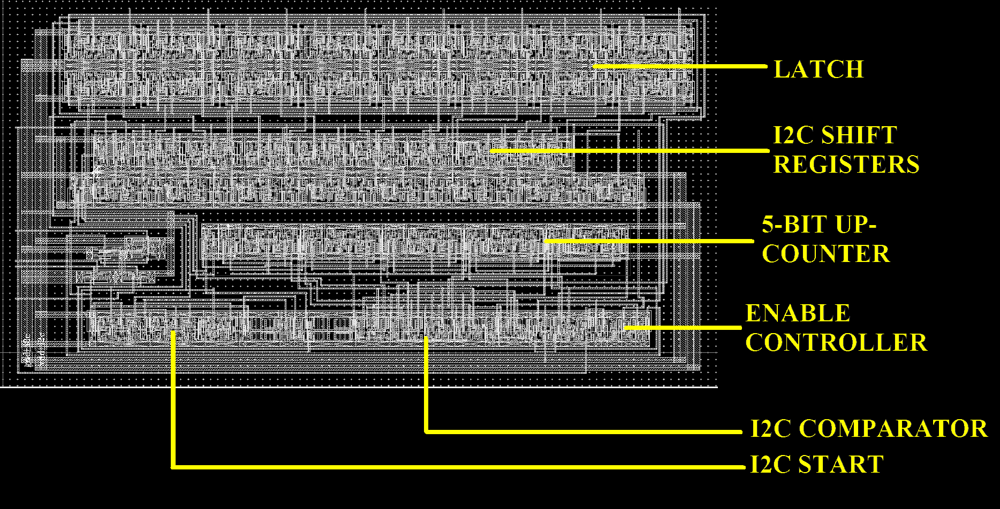|
|:--:| 
|*Figure 10: I2C Layout*|

## Conclusions

This article describes the design of I2C slave circuitry for write and read operations from a latch unit, implemented in a 0.6μm CMOS technology. Using the Cadence Virtuoso and Cadence Assura design tools, we were able to test and verify the timing diagrams and layout connections of the same. The fast plus mode of I2C having a 1MHz clock was implemented with a single master and single slave having a 7-bit address, both the read and write operations were executed successfully.

## Acknowledgement

We would like to thank our institution for equipping us with Advanced VLSI Lab facilities to successfully execute our project. We are also grateful to our mentor, Dr. Saroj Rout (linkedin.com/in/sroutk) for his constant advice and guidance throughout the project duration.

## References

[1] "I2C Licensing Information" (PDF). nxp.com. Archived (PDF) from the original on 2017-01-10. Retrieved 2018-04-29.  
[2] "Financial Press Releases-NXP". investors.nxp.com. Retrieved 2018-04-29.  
[3] "Benefits of Power Supplies Equipped with I2C Ethernet Communications". Aegis Power Systems, Inc. Aegis Power Systems, Inc. Archived from the original on 2015-12-21. Retrieved 2015-12-21.  
[4] "I2C-bus specification and user manual" (PDF). Rev.  
6. NXP. 2014-04-04. UM10204. Archived (PDF) from the original on 2013-05-11.  
[5] "7-bit, 8-bit, and 10-bit I2C Slave Addressing". Total Phase. Archived from the original on 2013- 06-01. Retrieved 2018-04-29.  
